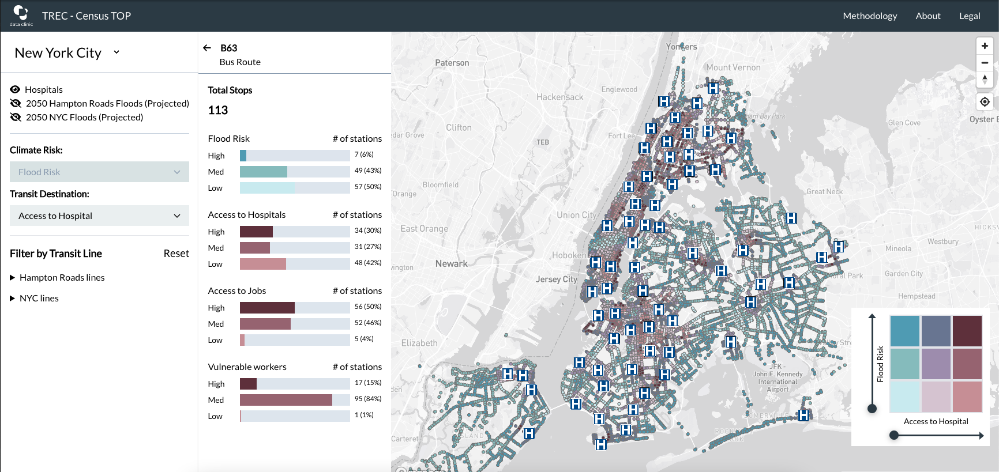

  

# Transit Resilience for Essential Commuting (TREC)

  

In the fall of 2022, Data Clinic took part in [The Opportunity Project](https://opportunity.census.gov/), a semi-annual sprint organized by the U.S. Census in partnership with federal agencies to demonstrate the value of open data, as part of the [Building Climate Change Resilience Through Public Transit](https://opportunity.census.gov/sprints/) sprint sponsored by the U.S. Department of Transportation.

Across our many conversations with transit officials, researchers, and community organizers from across the country about the climate-related challenges and opportunities transportation systems face, a recurring theme was the desire to enable a better understanding of climate's intersectional impact on both transit and communities. In other words, a flooded bus stop doesn't just mean that the bus and passengers can't access the stop, but it may also impede access to a hospital or community support, or to a large amount of essential jobs. How can we share that insight more effectively?

In response, we built [Transit Resilience for Essential Commuting (TREC)](https://trec.tsdataclinic.com), an open source tool that allows users to efficiently assess the climate risk for transit stations within the context of the access it provides to vital services and regions. Initially focused on flooding, the most prevalent climate event facing transit officials across the country, and access to hospital and jobs, TREC allows users to explore our open data-derived, station-specific risk and access ratings, and easily filter those with the highest climate risk and highest importance for access.

Our hope is that this human-centered and geospatial approach to the intersectional impact of climate change on transit and communities will give transit planners a more holistic picture to inform their infrastructure improvement decision-making. Further, we hope that making localized climate resilience tools like this open source, user-friendly, and publicly available, will empower community organizations to advocate for their underserved constituents.

The climate crisis we face requires collective intelligence and creative problem solving, and democratizing access to these kinds of tools will be crucial in making progress.

### Processed Data Files

Our app relies on two data files that we process using the data sources (listed below). These files are:

- [Stop Features](public/data/stop_features.geojson): Stop level dervived metrics described in the data dictionary
- [Hospitals](public/data/hospitals.geojson): Locations of hospitals within included cities

#### Derived Metrics Data Dictionary

| Variable                   | Description                                                 | Type | License    | Source                                                                                                                                                                                                                                                                                                  |
| -------------------------- | ----------------------------------------------------------- | ---- | ---------- | ------------------------------------------------------------------------------------------------------------------------------------------------------------------------------------------------------------------------------------------------------------------------------------------------------- |
| stop_id                    | GTFS feed stop id                                           | str  | [Apache 2.0](Apache2.0) | GTFS Feeds                                                                                                                                                                                                                                                                                              |
| stop_name                  | GTFS feed stop names                                        | str  | [Apache 2.0](Apache2.0) | GTFS Feeds                                                                                                                                                                                                                                                                                              |
| routes_serviced            | List of all routes servicing a stop                         | list | [Apache 2.0](Apache2.0) | GTFS Feeds                                                                                                                                                                                                                                                                                              |
| flood_risk_category        | Score 0/1/2 indicating low/medium/high flood risk around transit stop         | int  | [CC BY-NC-SA 4.0](CC4.0-BY-NC-SA)     | [First Street Climate-Adjusted Flood Risk](https://aws.amazon.com/marketplace/pp/prodview-r36lzzzjacd32?sr=0-1&ref_=beagle&applicationId=AWSMPContessa#overview), GTFS Feeds |
| hospital_access_cateogory  | Score 0/1/2 indicating low/medium/high hospital access from transit stop      | int  | [Apache 2.0](Apache2.0) | [Geographic Names Information System National File 2021](https://www.usgs.gov/u.s.-board-on-geographic-names/download-gnis-data), GTFS Feeds                                                                                                                                                         |
| job_access_category        | Score 0/1/2 indicating low/medium/high number of jobs around transit stop           | int  | [Apache 2.0](Apache2.0) | [LEHD Origin-Destination Statistics](https://lehd.ces.census.gov/data/), GTFS Feeds                                                                                                                                                                             |
| vulnerable_worker_category | Score 0/1/2 indicating low/medium/high vulnerability of people working around transit stop | int  | [Apache 2.0](Apache2.0) | [LEHD Origin-Destination Statistics](https://lehd.ces.census.gov/data/), [Open Street Maps](https://www.openstreetmap.org/about), [CDC/ATSDR Social Vulnerability Index](https://www.atsdr.cdc.gov/placeandhealth/svi/data_documentation_download.html), GTFS Feeds                            |
| geometry                   | Latitude/longitude point location of stop                   | wkt  | [Apache 2.0](Apache2.0) | GTFS Feeds                                                                                                                                                                                                                                                                                              |
### Contributing
To contribute to this project, refer to more details on 
- setting-up the Data pipeline in [`analysis`](analysis/)
- running the web-app locally in [`app`](app/)

You can also submit Bug reports or Feature requests with [Github issues](https://github.com/tsdataclinic/TREC/issues/new/choose) using the respective templates.

To discuss tailored adaptations of TREC to your team/city, please email us at dataclinic@twosigma.com

### Data Sources

All data accessed as of Febuary 21st, 2023.

- Census tract, block geographies retrieved using [TidyCensus](https://walker-data.com/tidycensus/) with data by [US Census Bureau](https://www.census.gov/) 
- Flood risk data from [First Street Climate-Adjusted Flood Risk - US Aggregate Data](https://aws.amazon.com/marketplace/pp/prodview-r36lzzzjacd32?sr=0-1&ref_=beagle&applicationId=AWSMPContessa#overview) by [First Street Foundation](https://firststreet.org/), [CC BY-NC-SA 4.0](https://creativecommons.org/licenses/by-nc-sa/4.0/)
- Employee location data from [LEHD Origin-Destination Employment Statistics](https://lehd.ces.census.gov/data/) by [US Census Bureau](https://www.census.gov/)
- Social vulnerability data from [CDC/ATSDR Social Vulnerability Index](https://www.atsdr.cdc.gov/placeandhealth/svi/data_documentation_download.html) by [Centers for Disease Control and Prevention Agency for Toxic Substances and Disease Registry](https://www.atsdr.cdc.gov/) 
- Street networks retrieved using [OSMnx](https://github.com/gboeing/osmnx) with data by [Open Street Maps](https://www.openstreetmap.org/about),  [Open Database License, "ODbL" 1.0](http://www.opendatacommons.org/licenses/odbl/) 
- Hospital location data from [here](https://geonames.usgs.gov/docs/stategaz/NationalFile.zip) (direct download link) by [United States Geological Survey](https://www.usgs.gov/) 
- New York City transit stops data was downloaded from [Metropolitan Transportation Authority](http://web.mta.info/developers/developer-data-terms.html#data) 
- Hampton Roads transit stops were downloaded from [Hampton Roads Transit](https://gtfs.gohrt.com/)
- New York City stormwater flood map data was downloaded from [NYC Department of Environmental Protection](http://nyc.gov/stormwater-map)
- Hampton Roads sea-level rise planning scenarios were downloaded from [Hampton Roads Geographic Exchange Online](https://www.hrgeo.org/search?q=SLR)

### Data Clinic
[Data Clinic](https://www.twosigma.com/data-clinic/) is the data and tech-for-good arm of [Two Sigma](https://twosigma.com), a financial sciences company headquartered in NYC. Since Data Clinic was founded in 2014, we have provided pro bono data science and engineering support to mission-driven organizations around the world via close partnerships that pair Two Sigma's talent and way of thinking with our partner's rich content-area expertise. To scale the solutions and insights Data Clinic has gathered over the years, and to contribute to the democratization of data, we also engage in the development of open source tooling and data products.
